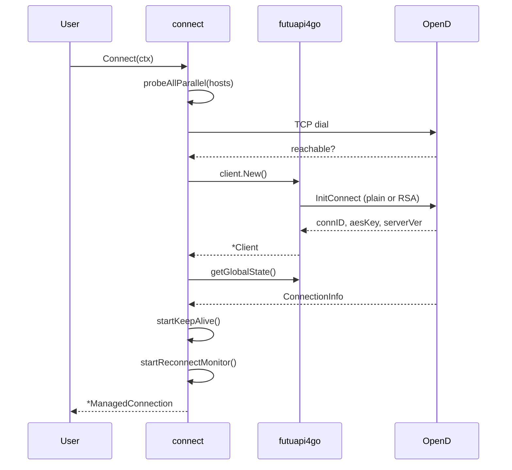
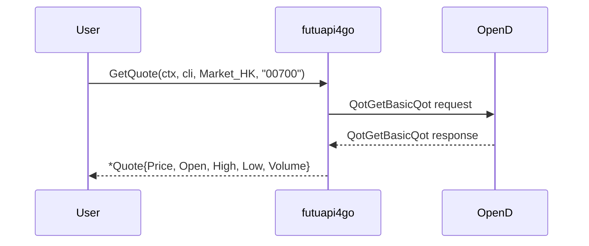
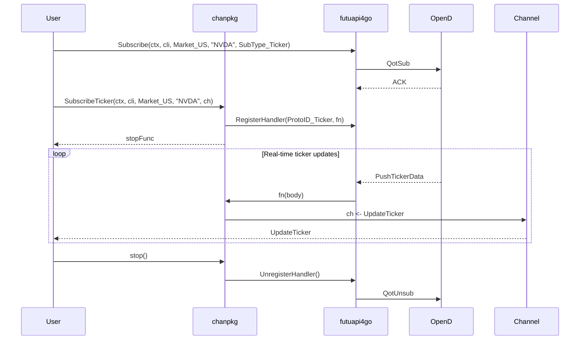
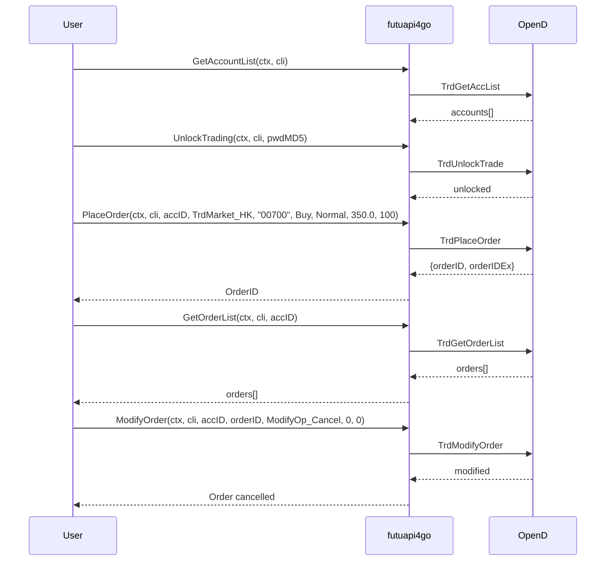
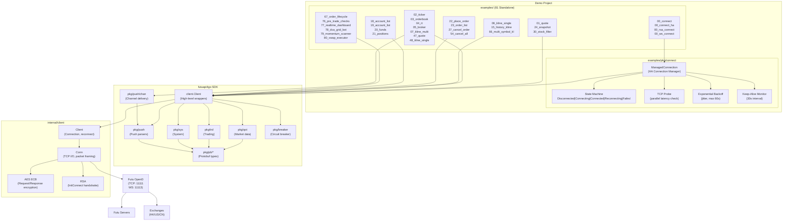

# futuapi4go-demo Architecture

> Architecture documentation for the futuapi4go SDK demo project.

## Overview

This project is a collection of **81 standalone Go examples** demonstrating the [futuapi4go](https://github.com/shing1211/futuapi4go) SDK for Futu OpenAPI. Each example is a self-contained `main.go` that showcases a specific SDK function or trading workflow.

**Key stats:**
- 81 examples (00–80)
- SDK: v0.5.17 (Futu OpenD API v10.5.6508)
- 9 functional areas

---

## Project Structure

```
futuapi4go-demo/
└── examples/
    ├── pkg/
    │   └── connect/          # Shared HA connection manager (used by all 81 examples)
    ├── 00_connect/          # Plain TCP connection
    ├── 00_connect_ha/       # High-availability multi-host connection
    ├── 00_rsa_connect/      # RSA-encrypted remote connection
    ├── 00_ws_connect/       # WebSocket connection (placeholder)
    ├── 01_quote/            # One-shot quote
    ├── 02_ticker/           # Real-time ticker push
    ├── 03_orderbook/        # Real-time order book push
    ├── 04_rt/               # Real-time price push
    ├── 05_broker/           # Real-time broker queue push
    ├── 06_kline_single/      # Historical K-lines (one-shot)
    ├── 07_kline_multi/      # Multi-period K-line push
    ├── 08_orderbook_req/    # Order book (one-shot)
    ├── 09_ticker_req/       # Ticker data (one-shot)
    ├── 10_rt_req/           # RT data (one-shot)
    ├── 11_broker_req/       # Broker queue (one-shot)
    ├── 12_capital_flow/      # Capital flow analysis
    ├── 13_plate_set/        # Plate set query
    ├── 14_plate_stock/      # Stocks in a plate
    ├── 15_history_kline/    # Historical K-line pagination
    ├── 16_market_state/     # Market open/close state
    ├── 17_global_state/      # OpenD connection state
    ├── 18_account_list/     # List trading accounts
    ├── 19_account_list/     # Full account info
    ├── 20_funds/            # Account funds/power
    ├── 21_positions/        # Current positions
    ├── 22_place_order/      # Place a buy/sell order
    ├── 23_order_list/       # Open orders
    ├── 24_snapshot/         # Multi-stock snapshot
    ├── 25_trade_date/       # Market trade dates
    ├── 26_price_reminder/   # Get price alerts
    ├── 27_cancel_order/     # Cancel/modify order
    ├── 28_owner_plate/       # Stocks by plate
    ├── 29_capital_dist/     # Capital distribution
    ├── 30_stock_filter/     # Stock screening
    ├── 31_ipo_list/         # IPO calendar
    ├── 32_future_info/      # Futures contract info
    ├── 33_suspend/          # Suspension dates
    ├── 34_holding_change/   # Director holdings
    ├── 35_rehab/            # Price adjustment factors
    ├── 36_code_change/       # Code change history
    ├── 37_warrant/          # Warrant list
    ├── 38_option_chain/      # Option chain
    ├── 39_option_expiration/ # Option expiry dates
    ├── 40_reference/         # Related securities
    ├── 41_user_security/     # Watchlist management
    ├── 42_history_order/    # Historical orders
    ├── 43_order_fill/       # Order fills
    ├── 44_history_fill/     # Historical fills
    ├── 45_acc_trading_info/  # Max quantities + margin
    ├── 46_user_info/         # User info
    ├── 47_subscribe_quote/   # Quote push (channel)
    ├── 48_subscribe_kline/   # Single K-line type push
    ├── 49_subscribe_pr/      # Price reminder push
    ├── 50_unsubscribe/        # Selective unsubscribe
    ├── 51_unsubscribe_all/   # Unsubscribe all
    ├── 52_query_sub/          # Subscription status
    ├── 53_reg_qot_push/      # Register/unregister push
    ├── 54_cancel_all_order/  # Cancel all open orders
    ├── 55_max_trd_qtys/      # Maximum tradable quantities
    ├── 56_order_fee/         # Fee breakdown
    ├── 57_margin_ratio/       # Margin ratios
    ├── 58_flow_summary/       # Cash flow entries
    ├── 59_static_info/        # Static security info
    ├── 60_modify_user_sec/    # Watchlist add/remove
    ├── 61_sub_info/           # Subscription quota info
    ├── 62_set_price_reminder/ # Set price alert
    ├── 63_sub_acc_push/       # Account push notifications
    ├── 64_reconfirm_order/     # Reconfirm order
    ├── 65_history_kl_quota/    # Historical K-line quota
    ├── 66_multi_symbol_kl/     # Batch K-line retrieval
    ├── 67_order_lifecycle/      # Full order workflow
    ├── 68_market_hours/        # Market timing check
    ├── 69_subscribe_handler/    # Multi-type push handlers
    ├── 70_futures_acc_list/     # Futures accounts
    ├── 71_futures_cash/        # Futures margin/cash
    ├── 72_futures_positions/     # Futures positions
    ├── 73_options_acc_list/     # Options accounts
    ├── 74_options_cash/        # Options buying power
    ├── 75_options_positions/     # Combined positions
    ├── 76_pre_trade_checks/     # Pre-trade validation
    ├── 77_realtime_dashboard/   # Multi-symbol monitoring
    ├── 78_dca_grid_bot/         # DCA + Grid strategy
    ├── 79_momentum_scanner/     # Stock screening + analysis
    └── 80_vwap_executor/        # VWAP execution
```

---

## Functional Areas

### 1. Connection (00 Connect Series)

**Examples:** `00_connect`, `00_connect_ha`, `00_rsa_connect`, `00_ws_connect`

Implements the entry point for all examples. The `examples/pkg/connect` package provides a **High-Availability managed connection** used by all 81 examples.

Key features:
- Multi-host failover with parallel TCP probe
- Per-host RSA encryption configuration
- Auto-reconnect on connection loss with exponential backoff + jitter
- Keep-alive monitoring (30s interval)
- Connection state machine: `Disconnected → Connecting → Connected → Reconnecting → Failed`

```
State Machine:
Disconnected ──Connect()──▶ Connecting ──success──▶ Connected ──disconnect──▶ Reconnecting
                                  │                    │                        │
                                  └──failure──▶ Failed ◀────────────────────┘
```

### 2. Market Data — One-Shot (01–16, 24–40)

**Examples:** `01_quote`, `06_kline_single`, `08_orderbook_req`, `09_ticker_req`, `10_rt_req`, `11_broker_req`, `12_capital_flow`, `13_plate_set`, `14_plate_stock`, `15_history_kline`, `16_market_state`, `24_snapshot`, `25_trade_date`, `28_owner_plate`, `29_capital_distribution`, `30_stock_filter`, `31_ipo_list`, `32_future_info`, `33_suspend`, `34_holding_change`, `35_rehab`, `36_code_change`, `37_warrant`, `38_option_chain`, `39_option_expiration`, `40_reference`

One-shot request/response APIs. Send a request, get a response, done. No subscription needed for HK stocks. US stocks require `client.Subscribe` before data is returned.

### 3. Market Data — Real-Time Push (02–07, 47–49, 69)

**Examples:** `02_ticker`, `03_orderbook`, `04_rt`, `05_broker`, `07_kline_multi`, `47_subscribe_quote`, `48_subscribe_kline_single`, `49_subscribe_price_reminder`, `69_subscribe_handler`

Push-based streaming. The `chanpkg` helpers (`SubscribeTicker`, `SubscribeOrderBook`, `SubscribeRT`, `SubscribeBroker`, `SubscribeKLines`, etc.) create buffered Go channels that receive real-time updates from OpenD.

Two variants:
- **Channel-based** — single data type via `chan<-` (e.g., `SubscribeTicker`, `SubscribeQuote`)
- **Callback-based** — multiple K-line periods via `map[KLType]func(*UpdateKL)` (e.g., `SubscribeKLines`)

### 4. Trading — Orders (22–27, 54, 64)

**Examples:** `22_place_order`, `23_order_list`, `27_cancel_order`, `54_cancel_all_order`, `64_reconfirm_order`

Core trading operations. All require an unlocked trading account (`FUTU_TRADE_PWD`) and use the `PlaceOrder` / `ModifyOrder` flow.

### 5. Trading — Funds & Positions (19–21, 43–45, 55–58)

**Examples:** `19_account_list`, `20_funds`, `21_positions`, `43_order_fill`, `44_history_fill`, `45_acc_trading_info`, `55_max_trd_qtys`, `56_order_fee`, `57_margin_ratio`, `58_flow_summary`

Account management. Queries for cash, buying power, positions, order fills, and margin requirements.

### 6. Futures & Options (70–75)

**Examples:** `70_futures_account_list`, `71_futures_cash`, `72_futures_positions`, `73_options_account_list`, `74_options_cash`, `75_options_positions`

Separate account category via `cli.Trade().GetAccList(TrdCategory_Future)` and `TrdCategory_Options`. Futures use `TrdMarket_Futures`.

### 7. Advanced Combos (66–68, 76–80)

**Examples:** `66_multi_symbol_kline`, `67_order_lifecycle`, `68_market_hours`, `76_pre_trade_checks`, `77_realtime_dashboard`, `78_dca_grid_bot`, `79_momentum_scanner`, `80_vwap_executor`

Multi-API workflows combining market data, account queries, and order placement into complete trading strategies.

### 8. Watchlist / User Security (41, 60, 62)

**Examples:** `41_user_security`, `60_modify_user_security`, `62_set_price_reminder`, `26_price_reminder`, `49_subscribe_price_reminder`

User-defined watchlists and price alert management.

### 9. System & Diagnostics (17, 46, 50–53, 61, 63, 65)

**Examples:** `17_global_state`, `46_user_info`, `50_unsubscribe`, `51_unsubscribe_all`, `52_query_subscription`, `53_reg_qot_push`, `61_sub_info`, `63_sub_acc_push`, `65_history_kl_quota`

OpenD connection state, subscription management, quota monitoring, and account push notifications.

---

## Key Execution Flows

### Flow 1: Basic Connection



### Flow 2: One-Shot Market Data



### Flow 3: Real-Time Push via Channel



### Flow 4: Order Lifecycle



---

## Architecture Diagram



---

## Dependencies

```
futuapi4go-demo
└── github.com/shing1211/futuapi4go v0.5.17
    ├── google.golang.org/protobuf v1.36.x
    ├── github.com/prometheus/client_golang v1.20.x
    ├── github.com/gorilla/websocket v1.5.x
    └── golang.org/x/sys
```

---

## Key Design Decisions

| Decision | Rationale |
|----------|-----------|
| One `main.go` per example | Maximum isolation — no shared state between examples |
| `examples/pkg/connect` shared | HA connection logic centralized; all 81 examples use it |
| Simulate trading by default | Safe — no real orders possible without `FUTU_TRADE_PWD` |
| Channel-based push | Idiomatic Go — `chanpkg` provides goroutine-safe buffered channels |
| ManagedConnection state machine | Auto-reconnect + keep-alive make examples resilient to OpenD restarts |
| Exponential backoff + jitter | Prevents thundering herd on OpenD restart |

## See Also

- **[futuapi4go](https://github.com/shing1211/futuapi4go)** — the Go SDK this demo is built on
- [CHANGELOG](CHANGELOG.md) — version history and release notes
- [AGENTS](AGENTS.md) — agent/dev workflow guide
