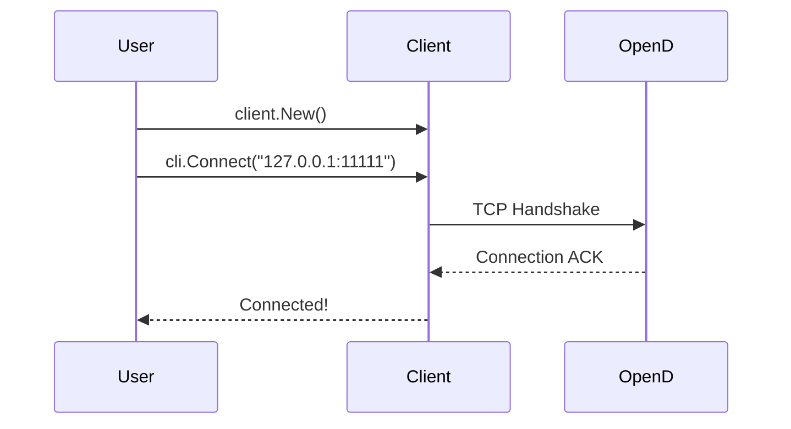
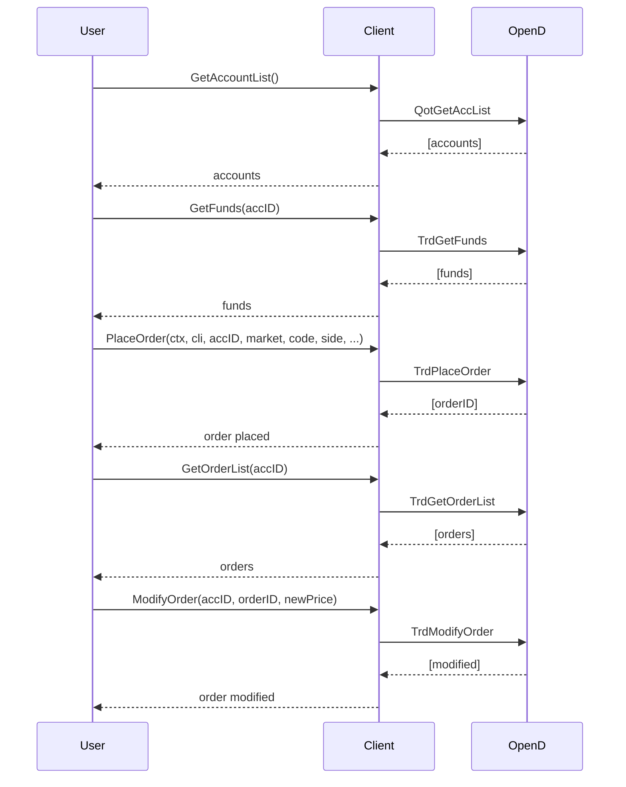
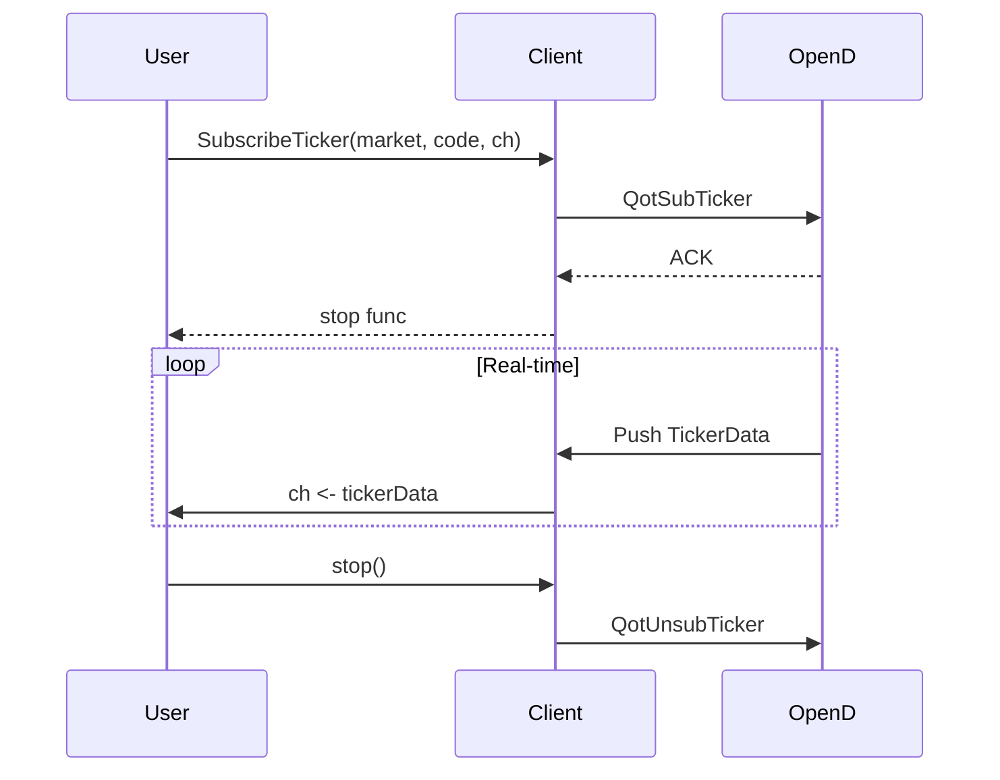

# futuapi4go-demo Architecture

> Architecture documentation generated from knowledge graph analysis.

## Overview

This project is a collection of **81 standalone Go examples** demonstrating the [futuapi4go](https://github.com/shing1211/futuapi4go) SDK for 富途 (Futu) OpenAPI. Each example is a self-contained `main.go` that showcases a specific SDK function or trading workflow.

**Key Stats:**
- 81 examples (00-80)
- 225 graph nodes, 149 edges
- 93 communities identified
- SDK: v0.5.12

---

## Functional Areas

### 1. Connection & Environment (Community 0)

```
Examples: 00_connect, 00_ws_connect
```

- `client.New()` - Create client instance
- `cli.Connect(addr)` - TCP connection to OpenD
- Environment variables: `FUTU_ADDR`, `FUTU_TRADE_PWD`
- Trading modes: Simulate (TrdEnv=0) vs Real (TrdEnv=1)

### 2. Market Data - One-Shot (Community 0, 1)

```
Examples: 01_quote, 06_kline_single, 08-11, 24_snapshot
```

- `client.GetQuote` - Current price
- `client.GetKLines` - K-line data (1min, 5min, Day, etc.)
- `client.GetOrderBook` - Level 2 order book
- `client.GetTicker` - Tick data
- `client.GetSecuritySnapshot` - Batch quotes with stats

### 3. Market Data - Push Streaming (Community 0)

```
Examples: 02_ticker, 03_orderbook, 04_rt, 05_broker, 07_kline_multi
```

- `chanpkg.SubscribeTicker` - Real-time tick stream
- `chanpkg.SubscribeOrderBook` - Order book updates
- `chanpkg.SubscribeRT` - Real-time price
- `chanpkg.SubscribeKLines` - K-line push stream

### 4. Trading - Orders (Community 0)

```
Examples: 22_place_order, 23_order_list, 27_cancel_order, 54_cancel_all
```

- `client.PlaceOrder` - Submit buy/sell order
- `client.GetOrderList` - Query open orders
- `client.ModifyOrder` - Cancel or update order
- `client.CancelAllOrder` - Cancel all open orders

### 5. Account Management (Community 0)

```
Examples: 18_account_list, 19_account_list, 20_funds, 21_positions
```

- `client.GetAccountList` - List all accounts
- `client.GetAccountInfo` - Account details
- `client.GetFunds` - Cash, buying power
- `client.GetPositionList` - Current holdings

### 6. Futures & Options (Community 0)

```
Examples: 70_futures_account_list, 71_futures_cash, 72_futures_positions
         73_options_account_list, 74_options_cash, 75_options_positions
```

- `cli.Trade().GetAccList(TrdCategory_Future)` - Futures accounts
- `cli.Trade().GetAccList(TrdCategory_Options)` - Options accounts
- `GetPositionList(TrdMarket_Futures)` - Futures positions

### 7. Advanced Strategies (Community 0)

```
Examples: 76_pre_trade_checks, 77_realtime_dashboard
         78_dca_grid_bot, 79_momentum_scanner, 80_vwap_executor
```

- Pre-trade validation (market state, funds, positions)
- Real-time dashboard with ticker subscriptions
- DCA + Grid trading automation
- Stock screening + K-line momentum analysis
- Order book + VWAP execution algorithm

---

## Key Execution Flows

### Flow 1: Basic Connection



### Flow 2: Order Lifecycle



### Flow 3: Push Subscription



---

## Architecture Diagram

```mermaid
graph TB
    subgraph "Client Layer"
        CLI[client.New]
        CONN[cli.Connect]
    end

    subgraph "Environment"
        ENV1[FUTU_ADDR]
        ENV2[FUTU_TRADE_PWD]
    end

    subgraph "Market Data APIs"
        MD1[GetQuote]
        MD2[GetKLines]
        MD3[GetOrderBook]
        MD4[GetTicker]
        MD5[GetSecuritySnapshot]
    end

    subgraph "Push APIs"
        PUSH1[SubscribeTicker]
        PUSH2[SubscribeOrderBook]
        PUSH3[SubscribeKLines]
        PUSH4[SubscribeRT]
    end

    subgraph "Trading APIs"
        TRD1[PlaceOrder]
        TRD2[GetOrderList]
        TRD3[ModifyOrder]
        TRD4[CancelAllOrder]
    end

    subgraph "Account APIs"
        ACC1[GetAccountList]
        ACC2[GetFunds]
        ACC3[GetPositionList]
        ACC4[GetAccTradingInfo]
    end

    subgraph "Futures/Options"
        FUT1[GetAccList_Future]
        FUT2[GetAccList_Options]
        FUT3[GetPositionList_Futures]
    end

    subgraph "Advanced"
        ADV1[StockFilter]
        ADV2[PreTradeChecks]
        ADV3[DCA Grid Bot]
        ADV4[Momentum Scanner]
        ADV5[VWAP Executor]
    end

    subgraph "OpenD Server"
        OPEND[Futu OpenD<br/>127.0.0.1:11111]
    end

    ENV1 --> CONN
    ENV2 --> CONN

    CLI --> CONN
    CONN --> OPEND

    MD1 --> OPEND
    MD2 --> OPEND
    MD3 --> OPEND
    MD4 --> OPEND
    MD5 --> OPEND

    PUSH1 --> OPEND
    PUSH2 --> OPEND
    PUSH3 --> OPEND
    PUSH4 --> OPEND

    TRD1 --> OPEND
    TRD2 --> OPEND
    TRD3 --> OPEND
    TRD4 --> OPEND

    ACC1 --> OPEND
    ACC2 --> OPEND
    ACC3 --> OPEND
    ACC4 --> OPEND

    FUT1 --> OPEND
    FUT2 --> OPEND
    FUT3 --> OPEND

    ADV1 --> MD5
    ADV2 --> ACC2
    ADV2 --> ACC3
    ADV2 --> MD5
    ADV3 --> TRD1
    ADV4 --> ADV1
    ADV4 --> MD5
    ADV4 --> MD2
    ADV5 --> MD3
    ADV5 --> TRD1
```



---

## API Packages

The SDK is organized into three main proto packages:

| Package | Description | Key APIs |
|---------|-------------|----------|
| `pkg/sys` | System APIs | GetGlobalState, GetTradeDate |
| `pkg/qot` | Market Data | GetQuote, Subscribe, GetKLines |
| `pkg/trd` | Trading | PlaceOrder, GetOrderList, GetFunds |

---

## Known Limitations

| API | Issue |
|-----|-------|
| `GetDelayStatistics` | Proto2/proto3 wire-format mismatch with OpenD |
| `GetTradeDate` | Requires OpenD serverVer >= 1004 |
| Simulate trading | Many order/flow APIs not supported |

---

## Dependencies

```
github.com/shing1211/futuapi4go v0.5.6
  └── golang.org/x/sys
  └── google.golang.org/protobuf
  └── github.com/prometheus/client_golang
  └── github.com/gorilla/websocket
```

---

## File Structure

```
futuapi4go-demo/
├── examples/           # 81 standalone examples
│   ├── 00_connect/    # Basic connection
│   ├── 01_quote/      # Quote API
│   ├── 02_ticker/     # Push subscription
│   ├── ...
│   ├── 67_order_lifecycle/    # Full workflow
│   └── 80_vwap_executor/     # Advanced strategy
├── docs/
│   └── FUTU_PROTO_REF.md    # Proto reference
├── go.mod
├── README.md
└── ARCHITECTURE.md    # This file
```